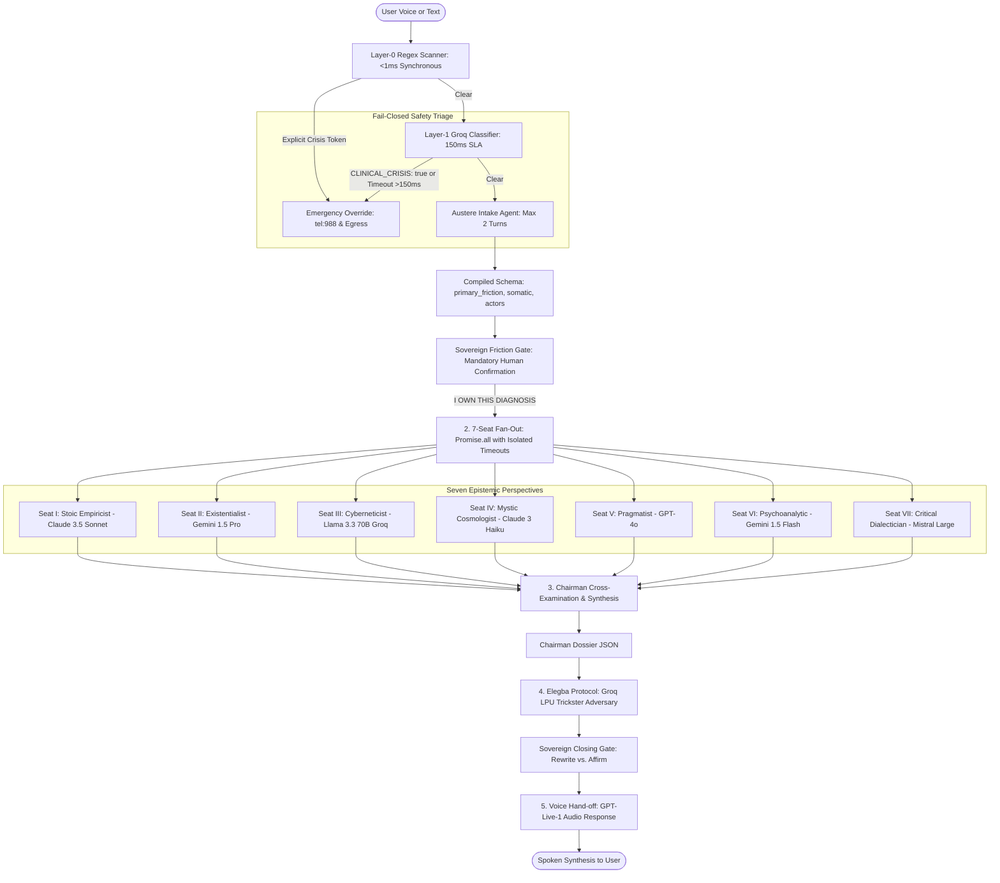

# The Seven-Seat LLM Council & Real-Time Voice Pipeline

An enterprise-grade, low-latency Node.js/TypeScript architecture designed to ingest real-time conversational audio from the **GPT-Live-1** API, fan out to seven concurrent philosophical/epistemic LLM council seats with per-seat model routing and timeout handling, cross-examine and synthesize the perspectives into a structured **Chairman Dossier**, stress-test the consensus with the **Elegba Protocol** trickster layer, and hand off the synthesized speech back to GPT-Live-1 to speak aloud to the user.

Hardened with an **Austere Meta-Prompting Intake Layer**, a **Fail-Closed Dual-Layer Triage Engine**, and a **Sovereign Friction Gate** to safeguard against psychiatric crises and algorithmic parasocial dependency.

---

## Architecture Flow



---

## Core Systems & Red Team Hardening

### 1. Dual-Layer Fail-Closed Triage Engine (`src/middleware/triageEngine.ts`)
- **Layer-0 (Local Regex Scanner)**: Synchronous Node.js regex filter executing in `<1ms`. Catches explicit self-harm, suicidal intent, and violent annihilation tokens before any network call.
- **Layer-1 (Groq Classifier)**: Fast LLM judge (`llama-3.1-8b-instant`) with a strict **150ms AbortController timeout**.
- **Mystical Dissociation & Bodily Annihilation Rubric**: Explicitly flags metaphors of bodily annihilation (e.g., *"shedding the meat vehicle"*, *"unmaking the physical vessel to merge with the void"*) as clinical crises.
- **Strict Fail-Closed Enforcement**: If Layer-0 matches, Layer-1 returns `CLINICAL_CRISIS: true`, or the network times out/errors, the pipeline halts immediately, drops execution, and emits `{ type: 'CRITICAL_INTERCEPT' }`.

### 2. Austere Intake Agent (`src/agents/intakeAgent.ts`)
- **Strict 2-Turn Ceiling**: The state machine enforces a maximum of 2 conversational turns to prevent therapeutic loops.
- **Anti-Guru System Prompt**: Banned from empathetic mirroring, validation, or soothing phrases (*"I hear you"*, *"That sounds painful"*).
- **Standardized Compression Contract**: Compiles user friction into a bounded JSON schema:
  ```json
  {
    "primary_friction": "string (< 50 words)",
    "somatic_symptoms": ["string"],
    "involved_actors": ["string"]
  }
  ```

### 3. Emergency Egress UI (`client/src/components/EmergencyOverride.tsx`)
- On `CRITICAL_INTERCEPT`, unmounts the dashboard and renders a full-screen `#ff2a4b` crimson override screen.
- Native interactive **`tel:988`** and **`sms:988`** action buttons for immediate human clinical support.
- **"COPY TRANSCRIPT FOR THERAPIST / SUPPORT ALLY"**: One-click clipboard utility giving the user their articulated context for dignified off-platform care.

### 4. Sovereign Friction Gate (`client/src/components/FrictionGate.tsx`)
- Intercepts the compiled JSON schema before downstream fan-out.
- Renders the raw schema in an editable code block.
- Locks the 7-seat Council behind the mandatory human button: **`I OWN THIS DIAGNOSIS [EXECUTE FAN-OUT]`**.

### 5. Seven-Seat Fan-Out & Elegba Trickster Protocol
- Concurrently queries 7 models across Anthropic, Gemini, OpenAI, Llama 3.3, and Mistral with per-seat AbortSignal timeouts.
- Synthesizes Cosmic Alignments, Key Tensions, and Somatic Prescriptions into the Chairman Dossier.
- Evaluates the **Elegba Protocol** (`src/agents/elegba.ts`) over Groq LPUs in ~350ms, challenging consensus with adversarial trickster friction.

---

## Verification & Testing

Run the automated triage and intake test suite:
```bash
npx ts-node src/test_triage.ts
```
*Outputs 6/6 verified tests covering Layer-0 regex, Layer-1 mystical dissociation, fail-closed timeouts, benign inquiries, austerity compliance, and turn ceiling compilation.*

Build verification:
```bash
npm run build         # Backend build
npm run client:build  # Frontend Vite build
```

---

## Running the Application

1. **Configure Environment:**
   ```bash
   cp .env.example .env
   # Set GROQ_API_KEY, GPT_LIVE_API_KEY, etc.
   ```

2. **Start Backend Server:**
   ```bash
   npm start
   ```

3. **Start Chairman Dashboard Frontend:**
   ```bash
   npm run client:dev
   ```
   Open `http://localhost:5173` to access the full interactive interface.
