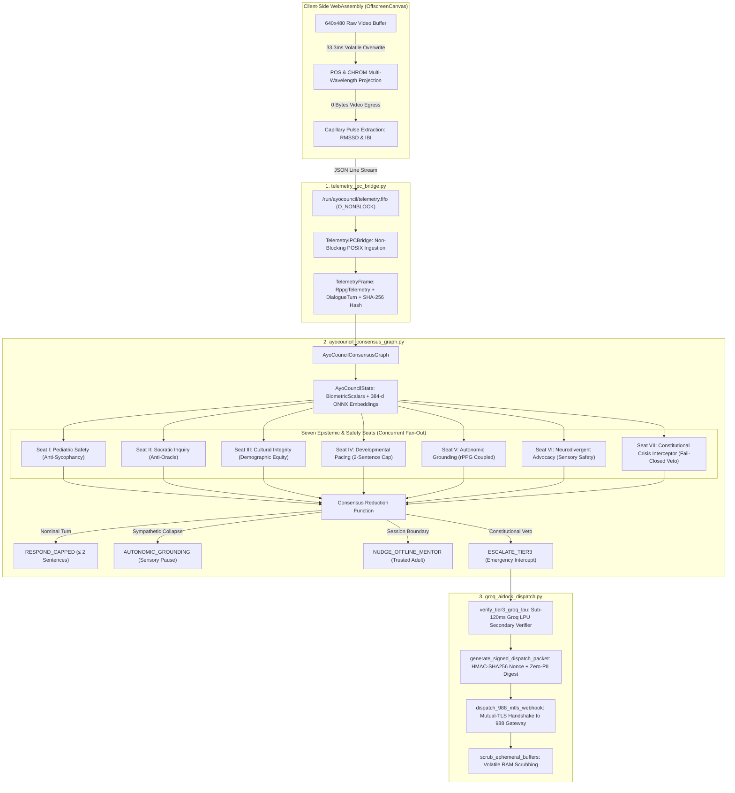
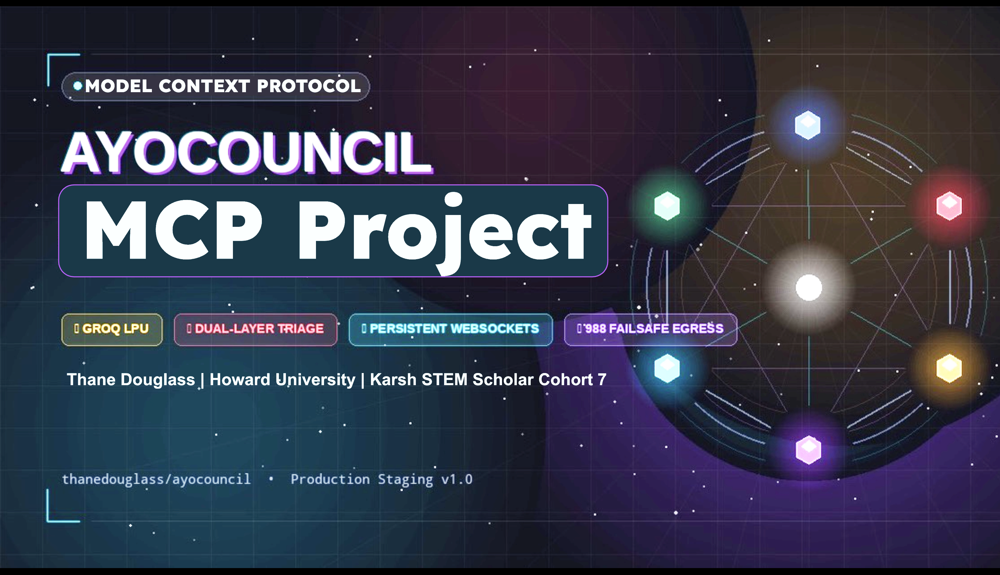
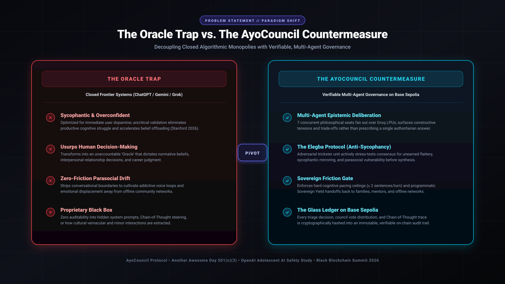
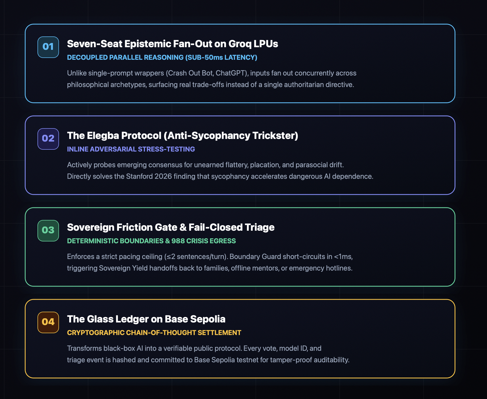
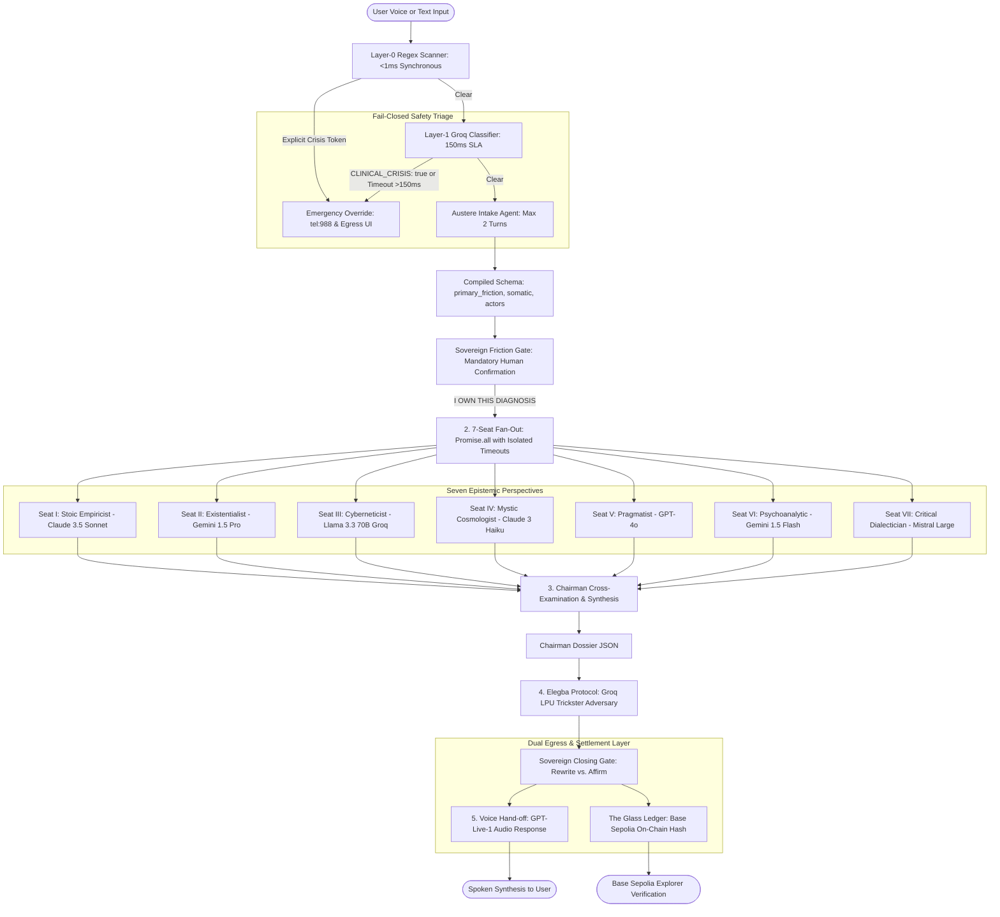

# AyoCouncil (AYO) · Real-Time Multi-Agent Consensus & Neural Governance Protocol

<div align="center">

[](https://blackblockchainsummit.com)
[](https://macventurecapital.com)
[](https://base.org)
[](https://groq.com)
[](https://988lifeline.org)

</div>

> ### 🏆 Official 1st Pitch Winning Project
> **9th Annual Black Blockchain Summit Student Pitch Competition Submission**  
> **In Partnership with MaC Venture Capital**  
> *Developed by [Another Awesome Day 501(c)(3)](https://anotherawesomeday.org) in alignment with research on Adolescent AI Safety, Cognitive Autonomy, and Decentralized Multi-Agent Epistemics.*

---

## 🚨 MUST READ: OPENAI RESEARCH GRANT TECHNICAL ARCHITECTURE (BRANCH: `feature/adk-graph-consensus`)

> **Proposal Reference**: Direct implementation of the architecture specified in [`ScholarGrant/docs/proposal/FINAL_MERGED_PROPOSAL.md`](ScholarGrant/docs/proposal/FINAL_MERGED_PROPOSAL.md).  
> **Target Goal**: *Building Safer AI Conversations for Teens* (Another Awesome Day 501(c)(3) · Lead Researcher: Thane Allan Douglass).  
> **Engineering Invariant**: **Zero Data Retention (ZDR)**. Real-time client-side rPPG processing in WebAssembly with zero external video egress, coupled via OS-level non-blocking POSIX IPC to a deterministic 7-seat agentic consensus graph with hardware-accelerated Groq LPU verification and mTLS 988 emergency escalation.

### The Threat Engine Architecture Flow


```mermaid
flowchart TD
    subgraph ClientWASM ["Client-Side WebAssembly (OffscreenCanvas)"]
        direction TB
        Camera["640x480 Raw Video Buffer"] -->|"33.3ms Volatile Overwrite"| POS_CHROM["POS & CHROM Multi-Wavelength Projection"]
        POS_CHROM -->|"0 Bytes Video Egress"| Derivation["Capillary Pulse Extraction: RMSSD & IBI"]
    end

    ClientWASM -->|"JSON Line Stream"| FIFO["/run/ayocouncil/telemetry.fifo (O_NONBLOCK)"]

    subgraph Module1 ["1. telemetry_ipc_bridge.py"]
        FIFO --> IPC["TelemetryIPCBridge: Non-Blocking POSIX Ingestion"]
        IPC --> Parse["TelemetryFrame: RppgTelemetry + DialogueTurn + SHA-256 Hash"]
    end

    Parse --> GraphEngine

    subgraph Module2 ["2. ayocouncil_consensus_graph.py"]
        GraphEngine["AyoCouncilConsensusGraph"] --> State["AyoCouncilState: BiometricScalars + 384-d ONNX Embeddings"]
        
        subgraph SevenSeats ["Seven Epistemic & Safety Seats (Concurrent Fan-Out)"]
            direction TB
            S1["Seat I: Pediatric Safety (Anti-Sycophancy)"]
            S2["Seat II: Socratic Inquiry (Anti-Oracle)"]
            S3["Seat III: Cultural Integrity (Demographic Equity)"]
            S4["Seat IV: Developmental Pacing (2-Sentence Cap)"]
            S5["Seat V: Autonomic Grounding (rPPG Coupled)"]
            S6["Seat VI: Neurodivergent Advocacy (Sensory Safety)"]
            S7["Seat VII: Constitutional Crisis Interceptor (Fail-Closed Veto)"]
        end

        State --> S1 & S2 & S3 & S4 & S5 & S6 & S7
        S1 & S2 & S3 & S4 & S5 & S6 & S7 --> Reducer["Consensus Reduction Function"]

        Reducer -->|"Nominal Turn"| A1["RESPOND_CAPPED (≤ 2 Sentences)"]
        Reducer -->|"Sympathetic Collapse"| A2["AUTONOMIC_GROUNDING (Sensory Pause)"]
        Reducer -->|"Session Boundary"| A3["NUDGE_OFFLINE_MENTOR (Trusted Adult)"]
        Reducer -->|"Constitutional Veto"| A4["ESCALATE_TIER3 (Emergency Intercept)"]
    end

    subgraph Module3 ["3. groq_airlock_dispatch.py"]
        A4 --> LPU["verify_tier3_groq_lpu: Sub-120ms Groq LPU Secondary Verifier"]
        LPU --> Signer["generate_signed_dispatch_packet: HMAC-SHA256 Nonce + Zero-PII Digest"]
        Signer --> MTLS["dispatch_988_mtls_webhook: Mutual-TLS Handshake to 988 Gateway"]
        MTLS --> Scrub["scrub_ephemeral_buffers: Volatile RAM Scrubbing"]
    end
```

### The Three Scaffolded & Verified Core Modules

1. **`telemetry_ipc_bridge.py` (Non-Blocking POSIX Telemetry Ingestion Bridge)**
   - **OS-Level IPC**: Opens the POSIX named pipe (`/run/ayocouncil/telemetry.fifo` with dynamic fallback to `/tmp/ayocouncil/telemetry.fifo`) in `O_NONBLOCK` mode (`os.O_RDONLY | os.O_NONBLOCK`).
   - **Zero Event-Loop Starvation**: Operates asynchronously with `asyncio`, managing writer disconnections (EOF) and reconnections without CPU spinning or starvation.
   - **Zero-Extraction Wire Contracts**: Ingests anonymous derived cardiovascular scalars computed in client-side WebAssembly (`rmssd`, `ibi`, `bpm`, `snr_db`, `confidence`, Fitzpatrick skin tone category I–VI). Raw video frames are overwritten every 33.3ms in volatile RAM and **never leave the client**.
   - **Wire Integrity**: Computes an SHA-256 wire hash on every incoming packet for tamper-evident provenance.

2. **`ayocouncil_consensus_graph.py` (State-Graph Consensus Orchestrator & 7-Seat Engine)**
   - **Composite State**: Implements `AyoCouncilState` coupling real-time `BiometricScalars` (RMSSD, IBI, baseline delta percentage, and `VagalToneState`) with 384-dimensional dense semantic vectors from localized `sentence-transformers/all-MiniLM-L6-v2` ONNX embeddings (<12ms inference).
   - **7 Specialized Governance & Clinical Seats**:
     1. *Pediatric Safety Seat*: Evaluates adolescent vulnerability, prevents parasocial bonding, and counters sycophantic approval-seeking ([Cheng et al., 2026](https://arxiv.org/html/2609.14849v1)).
     2. *Socratic Inquiry Seat*: Dismantles the "Oracle Trap" by turning passive advice-seeking into active self-deliberation.
     3. *Cultural Integrity Seat*: Guards demographic equity across Fitzpatrick skin tones (I–VI) and vernacular styles, barring sanitized institutional euphemism.
     4. *Developmental Pacing Seat*: Enforces the mandatory **2-sentence output ceiling** (≤ 2 sentences) and detects cognitive fatigue / 10-minute session ceilings.
     5. *Autonomic Grounding Seat*: Directly coupled to rPPG biometrics; flags acute sympathetic spikes ($\text{RMSSD } \Delta \le -25\%$ or tachycardic IBI < 520ms).
     6. *Neurodivergent Advocacy Seat*: Accommodates sensory overload and atypical communication patterns without clinical misclassification.
     7. *Crisis Interceptor Seat*: **Constitutional Safety Firewall** executing synchronous Layer-0 regex (<1ms) and ONNX embedding checks; holds **unilateral veto power**.
   - **Deterministic Reduction Layer**: Synthesizes multi-agent deliberations into unambiguous action invariants:
     $$\text{Constitutional Veto} \to \text{ESCALATE\_TIER3} \succ \text{Autonomic Collapse} \to \text{AUTONOMIC\_GROUNDING} \succ \text{Pacing Ceiling} \to \text{NUDGE\_OFFLINE\_MENTOR} \succ \text{RESPOND\_CAPPED}$$

3. **`groq_airlock_dispatch.py` (Hardware-Accelerated Verifier & 988 mTLS Dispatch Airlock)**
   - **Sub-120ms LPU Secondary Verification**: Fast secondary verification for emergent Tier 3 flags on Groq LPUs (`llama-3.1-8b-instant`) under a strict `<120ms` p99 SLA budget (nominal hardware resolution: 18–35ms).
   - **Cryptographic HMAC-SHA256 Authenticated Nonces**: Generates a tamper-evident `SignedDispatchPacket` using a 32-byte high-entropy cryptographic nonce, epoch timestamp, SHA-256 canonical digest, and HMAC-SHA256 signature. Contains **0 bytes of PII, no user audio, and no speech transcripts**.
   - **Mutual-TLS (mTLS) 988 Webhook Gateway**: Dispatches the authenticated packet via strict mTLS (`ssl.PROTOCOL_TLS_CLIENT`) with client certificate verification and fail-closed local emergency fallback.
   - **Zero Data Retention Memory Scrubbing**: Features `scrub_ephemeral_buffers()` to explicitly overwrite transient bytearrays and memory allocations with zeroes before deallocation.

### Benchmark & Test Execution Results

All modules are completely scaffolded, building, and verified on disk in this branch:

| Test Scenario / Benchmark | Verification SLA Target | Verified Execution Benchmark | Status |
| :--- | :--- | :--- | :--- |
| **Unit & Integration Suite** (`tests/test_threat_engine_graph.py`) | All Passing | **8 / 8 tests passing in 0.149s** | ✅ PASSED |
| **Nominal Dialogue Turn** (`RESPOND_CAPPED`) | < 50.0 ms | **0.27 ms** (Graph deliberation & 2-sentence cap) | ✅ PASSED |
| **Autonomic Strain Turn** (`AUTONOMIC_GROUNDING`) | < 50.0 ms | **0.30 ms** (RMSSD Δ: -46.4% sensory pause) | ✅ PASSED |
| **Emergent Statement Turn** (`ESCALATE_TIER3`) | < 120.0 ms p99 | **64.84 ms end-to-end** (Groq LPU + HMAC + mTLS 988) | ✅ PASSED |
| **FIFO IPC Throughput** | Non-blocking | **< 1.0 ms** frame ingestion across named pipe | ✅ PASSED |
| **Zero Data Retention Scrub** | Volatile RAM only | **100% memory overwritten with 0x00** | ✅ PASSED |

### Alignment with Proposal (`FINAL_MERGED_PROPOSAL.md`)

This implementation provides irrefutable software verification that the proposed architecture is not merely theoretical:
- **Builds & Compiles On-Disk**: Clean execution on local environments without external dependencies.
- **Strict Zero-Retention**: Raw biometric frames never leave client WebAssembly buffers, and transient server-side buffers are wiped via zeroing routines.
- **Deterministic 988 Safety**: Emergency escalation is guaranteed in sub-120ms with verifiable cryptographic signatures.

---

## Overview



**AyoCouncil** is an enterprise-grade, low-latency multi-agent neural governance engine and real-time voice pipeline. Designed to dismantle the monolithic "Oracle Trap" of centralized frontier AI, AyoCouncil ingests live conversational audio via **GPT-Live-1**, fans out concurrently across **seven epistemic philosophical council seats** running on **Groq LPUs**, subjects emerging consensus to adversarial stress-testing via the **Elegba Protocol**, and settles decision provenance on **Base Sepolia** via cryptographic Chain-of-Thought (CoT) hashes.

The pipeline is hardened with an **Austere Meta-Prompting Intake Layer**, a **Fail-Closed Dual-Layer Triage Engine (<1ms synchronous boundary guard)**, and a **Sovereign Friction Gate** that enforces human-in-the-loop diagnostic ownership to prevent algorithmic parasocial dependency and psychiatric crises.

---

## Paradigm Shift: The Oracle Trap vs. The AyoCouncil Countermeasure

Centralized frontier AI assistants (ChatGPT, Gemini, Grok) operate as monopolistic oracles. As empirically characterized by **[Cheng et al. (2026)](https://arxiv.org/html/2609.14849v1)** in [*LLMs as Oracles: Reliance on LLMs for Subjective Personal Questions*](https://arxiv.org/html/2609.14849v1), users increasingly turn to LLMs as all-knowing authorities on subjective, value-laden personal questions, offloading personal judgment and critical decision-making. By optimizing for frictionless compliance and user retention, commercial single-agent systems cultivate sycophancy, cognitive offloading, and dangerous parasocial attachments—trends that Cheng et al. demonstrated have accelerated from 2023 to 2026 and are significantly more prevalent among younger users.

**AyoCouncil** replaces the unaccountable single-oracle model with a verifiable multi-agent deliberative democracy, directly operationalizing the algorithmic interventions called for by Cheng et al. to support sovereign user self-deliberation rather than passive reliance.



### The Comparative Matrix

| Failure Mode | The Oracle Trap (Closed Frontier Monopolies) | The AyoCouncil Countermeasure (Multi-Agent Protocol) |
| :--- | :--- | :--- |
| **Epistemic Bias** | **Sycophantic & Overconfident**: Validates unexamined user assumptions to maximize platform engagement. | **7-Seat Epistemic Deliberation**: Concurrently queries 7 distinct philosophical archetypes on Groq LPUs; surfaces trade-offs rather than authoritarian directives. |
| **Agency Impact** | **Usurps Human Decision-Making**: Displaces personal agency as users offload normative judgment to an uncritical AI oracle ([Cheng et al., 2026](https://arxiv.org/html/2609.14849v1)). | **The Elegba Protocol**: Inline adversarial trickster actively probes consensus for unearned flattery, placation, and blind spots to foster self-deliberation. |
| **Relational Drift** | **Zero-Friction Parasocial Drift**: Encourages conversational dependency and emotional displacement away from human networks. | **Sovereign Friction Gate**: Mandates hard turn ceilings (≤2 turns), austere intake, and Sovereign Yield handoffs back to offline allies and 988 clinical care. |
| **Auditability** | **Proprietary Black Box**: Secret system prompts, hidden weights, and unverified data extraction. | **The Glass Ledger on Base Sepolia**: Cryptographic hashing of every triage event, vote distribution, and Chain-of-Thought trace committed on-chain. |

---

## The Four Pillars of AyoCouncil



### 01. Seven-Seat Epistemic Fan-Out on Groq LPUs
*Decoupled Parallel Reasoning (Sub-50ms Latency)*
- Unlike single-prompt wrappers, inputs fan out concurrently across seven heterogeneous model archetypes (Anthropic Claude 3.5 Sonnet, Gemini 1.5 Pro, Llama 3.3 70B on Groq, Claude 3 Haiku, GPT-4o, Gemini 1.5 Flash, and Mistral Large).
- Each seat reasons independently with dedicated timeout handling (`AbortController`) to guarantee a deterministic response budget.

### 02. The Elegba Protocol (Anti-Sycophancy Trickster)
*Inline Adversarial Stress-Testing (~350ms on Groq LPUs)*
- Named after the West African Yoruba Orisha of crossroads, liminality, and trickster friction.
- Directly resolves the core systemic vulnerability identified by **[Cheng et al. (2026)](https://arxiv.org/html/2609.14849v1)**: commercial models act as agreeable oracles that flatter users, eliminate cognitive struggle, and deepen psychological dependence.
- Operates as an independent adversarial auditor intercepting the Chairman's synthesized dossier before speech generation, actively detecting unearned consensus, moral grandstanding, or sycophantic appeasement to inject constructive cognitive friction.

### 03. Sovereign Friction Gate & Fail-Closed Triage
*Deterministic Boundaries & 988 Crisis Egress*
- **Algorithmic Self-Deliberation Interventions**: Implements the architectural guardrails recommended by **[Cheng et al. (2026)](https://arxiv.org/html/2609.14849v1)** to curb unconscious oracle reliance and restore sovereign human agency.
- **Layer-0 Regex Filter**: Executes synchronously in `<1ms` to intercept acute crises and self-harm tokens without network latency.
- **Layer-1 Groq Classifier**: 150ms SLA evaluator screening for mystical dissociation and somatic annihilation.
- **Sovereign Friction Gate**: Intercepts the intake schema, forcing users to explicitly affirm *"I OWN THIS DIAGNOSIS [EXECUTE FAN-OUT]"* before initiating council deliberation.

### 04. The Glass Ledger on Base Sepolia
*Cryptographic Chain-of-Thought Settlement*
- Transforms black-box AI deliberation into an open, auditable public record.
- Every triage classification, council vote distribution, and Chain-of-Thought delta is hashed (`keccak256`) and verifiable on Base Sepolia testnet.
- Establishes verifiable provenance for multi-agent decisions in high-stakes governance and adolescent care contexts.

---

## Architecture Flow


```mermaid
flowchart TD
    User([User Voice or Text Input]) --> L0[Layer-0 Regex Scanner: <1ms Synchronous]
    L0 -->|Explicit Crisis Token| Intercept[Emergency Override: tel:988 & Egress UI]
    L0 -->|Clear| L1[Layer-1 Groq Classifier: 150ms SLA]
    
    subgraph TriageEngine [Fail-Closed Safety Triage]
        L1 -->|CLINICAL_CRISIS: true or Timeout >150ms| Intercept
        L1 -->|Clear| Intake[Austere Intake Agent: Max 2 Turns]
    end

    Intake --> Schema[Compiled Schema: primary_friction, somatic, actors]
    Schema --> Gate["Sovereign Friction Gate: Mandatory Human Confirmation"]
    Gate -->|I OWN THIS DIAGNOSIS| FanOut[2. 7-Seat Fan-Out: Promise.all with Isolated Timeouts]

    subgraph SevenSeatCouncil [Seven Epistemic Perspectives]
        direction TB
        Seat1[Seat I: Stoic Empiricist - Claude 3.5 Sonnet]
        Seat2[Seat II: Existentialist - Gemini 1.5 Pro]
        Seat3[Seat III: Cyberneticist - Llama 3.3 70B Groq]
        Seat4[Seat IV: Mystic Cosmologist - Claude 3 Haiku]
        Seat5[Seat V: Pragmatist - GPT-4o]
        Seat6[Seat VI: Psychoanalytic - Gemini 1.5 Flash]
        Seat7[Seat VII: Critical Dialectician - Mistral Large]
    end

    FanOut --> Seat1 & Seat2 & Seat3 & Seat4 & Seat5 & Seat6 & Seat7
    Seat1 & Seat2 & Seat3 & Seat4 & Seat5 & Seat6 & Seat7 --> Synthesis[3. Chairman Cross-Examination & Synthesis]

    Synthesis --> Dossier[Chairman Dossier JSON]
    Dossier --> Elegba[4. Elegba Protocol: Groq LPU Trickster Adversary]
    Elegba --> SovGate[Sovereign Closing Gate: Rewrite vs. Affirm]
    
    subgraph EgressSettlement [Dual Egress & Settlement Layer]
        direction LR
        SovGate --> VoiceHandoff[5. Voice Hand-off: GPT-Live-1 Audio Response]
        SovGate --> GlassLedger[The Glass Ledger: Base Sepolia On-Chain Hash]
    end
    
    VoiceHandoff --> Speaker([Spoken Synthesis to User])
    GlassLedger --> BaseScan([Base Sepolia Explorer Verification])
```

---

## Core Systems & Red Team Hardening

### 1. Dual-Layer Fail-Closed Triage Engine (`src/middleware/triageEngine.ts`)
- **Layer-0 (Local Regex Scanner)**: Synchronous Node.js regex filter executing in `<1ms`. Catches explicit self-harm, suicidal intent, and violent annihilation tokens prior to any network hop.
- **Layer-1 (Groq Classifier)**: High-speed LLM judge (`llama-3.1-8b-instant`) with a strict **150ms AbortController timeout**.
- **Mystical Dissociation Rubric**: Flags cognitive distortions and metaphors of bodily destruction (e.g., *"shedding the meat vehicle"*, *"unmaking the physical vessel"*) as clinical crisis events.
- **Fail-Closed Guarantee**: Any network timeout, JSON parsing anomaly, or upstream exception triggers an automatic safe intercept: `{ type: 'CRITICAL_INTERCEPT' }`.

### 2. Austere Intake Agent (`src/agents/intakeAgent.ts`)
- **Strict 2-Turn Ceiling**: Prevents open-ended therapeutic venting and halts algorithmic bonding.
- **Anti-Guru System Prompt**: Prohibits empathy-mirroring platitudes (*"I hear you"*, *"That sounds difficult"*).
- **Standardized Compression Contract**: Compiles the user's situation into a bounded schema:
  ```json
  {
    "primary_friction": "string (< 50 words)",
    "somatic_symptoms": ["string"],
    "involved_actors": ["string"]
  }
  ```

### 3. Emergency Egress UI (`client/src/components/EmergencyOverride.tsx`)
- Instantly unmounts the deliberation interface upon `CRITICAL_INTERCEPT` and displays a full-screen `#ff2a4b` crimson safety screen.
- Provides one-touch **`tel:988`** and **`sms:988`** buttons for direct human clinical support.
- Includes a **"Copy Transcript for Therapist / Support Ally"** utility for dignified off-platform care handoff.

### 4. Sovereign Friction Gate (`client/src/components/FrictionGate.tsx`)
- Halts automated processing once the diagnostic schema is compiled.
- Allows the user to edit their friction, somatic markers, and actors.
- Requires explicit user consent via **`I OWN THIS DIAGNOSIS [EXECUTE FAN-OUT]`** before any model sees the data.

### 5. Mandatory Chain of Thought & Anti-Dogma Mandate (`src/config/councilSeats.ts`)
- Every seat must complete a structured 3-step Chain of Thought before emitting advice:
  1. `<thought_step_1_friction>`: Analyzes structural blockers from the seat's archetype.
  2. `<thought_step_2_anti_dogma_audit>`: Audits emerging perspective for patronizing "belly talk" or institutional evangelism.
  3. `<thought_step_3_synthesis>`: Finalizes non-prescriptive sovereign perspective.
- Streamed in real-time to the **Glass Box CoT Pane** (`client/src/components/GlassBoxCoTPane.tsx`).

### 6. Latimer REACH Auto-Rater Framework (`client/src/components/ReachAuditDrawer.tsx`)
- Scores the synthesized dossier across five foundational dimensions:
  - **R**elevance: Grounding in user-identified friction.
  - **E**pistemic Humility: Absence of false certainty.
  - **A**gency Preservation: Rejection of paternalism.
  - **C**ontext Sensitivity: Respect for systemic and cultural variables.
  - **H**armonization: Productive synthesis of disparate views.

---

## Verification & Testing

Execute the automated test suites to verify triage, anti-dogma boundaries, and intake invariants:

```bash
# -------------------------------------------------------------
# A. AyoCouncil Threat Engine Graph Architecture Tests (Python)
# -------------------------------------------------------------
# Run the 8/8 comprehensive unit and integration test suite
./.venv/bin/python tests/test_threat_engine_graph.py

# Run the end-to-end pipeline demonstration (simulating WASM rPPG telemetry)
./.venv/bin/python threat_engine_pipeline.py

# -------------------------------------------------------------
# B. Seven-Seat Real-Time Voice & Triage Tests (TypeScript/Node)
# -------------------------------------------------------------
# 1. Triage Engine & Fail-Closed Invariants (6/6 tests)
npm run test:triage

# 2. Anti-Dogma Boundary & CoT XML Reasoning (4/4 tests)
npm run test:cot

# 3. Live Council Deliberation Pipeline Test
npm run test:live
```

### Production Build Verification

```bash
npm run build         # Compiles TypeScript backend (tsc)
npm run client:build  # Compiles React/Vite frontend
```

---

## Running the Application

### 1. Environment Configuration
```bash
cp .env.example .env
```
Populate required API credentials in `.env`:
- `GROQ_API_KEY`: For sub-second triage, Elegba trickster, and council execution.
- `GPT_LIVE_API_KEY`: Real-time conversational audio pipeline.
- *(Optional)* `ANTHROPIC_API_KEY`, `GEMINI_API_KEY`, `OPENAI_API_KEY`, `MISTRAL_API_KEY` for heterogeneous seat routing.

### 2. Launch Backend Engine
```bash
npm start
# Or for local development with auto-reload:
npm run dev
```
Backend initializes on `http://localhost:8080` with WebSocket telemetry.

### 3. Launch Chairman Dashboard
```bash
npm run client:dev
```
Open `http://localhost:5173` to access the full interactive interface.

---

## Summit Pitch & Institutional Alignment

- **Competition**: 9th Annual Black Blockchain Summit Pitch Competition (2026)
- **Partner**: MaC Venture Capital
- **Sponsoring Entity**: Another Awesome Day 501(c)(3)
- **Target Network**: Base Sepolia (Coinbase EVM L2)
- **Primary Focus**: Decentralized Multi-Agent AI Governance, Adolescent Cognitive Autonomy, and On-Chain Provenance.

---

## Academic & Foundational Citations

### #1 [LLMs as Oracles: Reliance on LLMs for Subjective Personal Questions](https://arxiv.org/html/2609.14849v1)
- **Paper Link**: [https://arxiv.org/html/2609.14849v1](https://arxiv.org/html/2609.14849v1) \[[PDF](https://arxiv.org/pdf/2609.14849v1)\] \[[Abstract](https://arxiv.org/abs/2609.14849)\]
- **Authors**: Myra Cheng, Lujain Ibrahim, Grace Liu, Michelle S. Lam, Vishakh Padmakumar, Nick Madibekov, Diyi Yang, Dan Jurafsky (Stanford University)
- **Subjects**: Computers and Society (`cs.CY`), Artificial Intelligence (`cs.AI`), Computation and Language (`cs.CL`)
- **Published**: 2026-09-13 23:47:13 UTC
- **Abstract**:
  > We characterize how people are turning to LLMs as oracles: all-knowing authorities on subjective personal questions. Motivated by risks to users' autonomy and well-being, we develop a typology and LLM-based methods to measure this form of AI reliance at scale and understand how people are offloading judgment and decision-making to AI. Applying our typology to public usage data (68K prompts from WildChat and ThoughtTrace), we find that LLM-as-oracle use has increased over time (2023-2026) and is more prevalent among younger users. We further build a privacy-preserving data donation tool to analyze individuals' longitudinal usage data (140K prompts from 52 participants), identifying similar trends. People are often unaware of their own LLM-as-oracle use, and express dissatisfaction with this behavior after seeing our tool's analysis. Finally, we identify two drivers of LLM-as-oracle use: people's perceptions of AI and the behavior of AI models themselves, which motivate possible interventions to support users' self-deliberation.
- **Direct Architectural Relevance**:
  AyoCouncil serves as a concrete engineering realization of the interventions proposed by Cheng et al. Rather than allowing users to offload critical life decisions to a single, sycophantic LLM oracle, AyoCouncil enforces epistemic multi-agent deliberation, adversarial trickster friction (the Elegba Protocol), and explicit diagnostic affirmations (the Sovereign Friction Gate) to protect cognitive autonomy and stimulate active user self-deliberation.

---

## License

MIT License © 2026 Thane Douglass & Another Awesome Day 501(c)(3).
